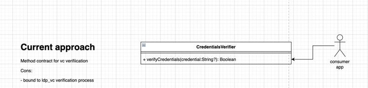
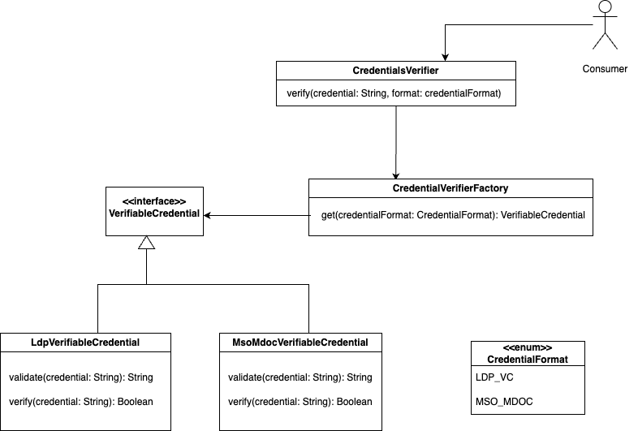

# 1. Record architecture decisions

Date: 2024-10-07

## Status

Accepted

## Context

Support for VC verification of different formats of VC like ldp_vc, mso_mdoc. 

The current design accepts credential as a string and performs the logic of vc verification specific to `ldp_vc` format VC. If a new format vc's verification process needs to be supported via this library, how will library identify what format VC's verification logic should be applied over the input credential.? 

## Decision

- Accept ``credentialFormat`` parameter in the verification method to identify the format of the vc
- Implement Factory pattern for verification of different format of VCs to keep the design of the library extensible for different formats of VC
- Support for current consumers?
  - To continue the support for existing consumers using the `verifyCredentials` method, the current method will be still exposed as a deprecated method to avoid breaking changes introduction
- Other changes
  - method name for verification will have the name ``verify`` state the functionality of the method
  - Method signature: verify(credential: String, credentialFormat: CredentialFormat): Boolean
  

## Consequences

- Existing consumers using the `verifyCredentials` method for verifying `ldp_vc` format VCs are not required to modify the usage of this library as the older method will still be supported in deprecated mode
- The introduction of the new method `verify` will be used further to identify the verification logic that needs to be applied over the `credential` based on the input `credentialFormat`, providing support for other credential formats (as per CredentialFormat constant exposed)

## People involved
Swati Goel, KiruthikaJeyashankar
