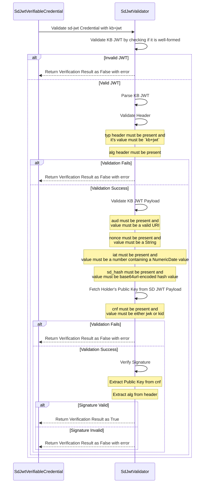

## Support for IETF SD-JWT KB JWT Verification

This document provides a comprehensive overview of verifying KB JWT for `vc+sd-jwt` and `dc+sd-jwt` Verifiable Presentation (VP).

### Cryptographic Key Binding Support
- `cnf` available in VC can either be `jwk`(JSON Web Key) or `kid`.
  - If `jwk` is present, it will contain the public key of the holder.
  - If `kid` is present, it will contain the reference to the public key of the holder.
    - Currently, only `did` is supported for `kid` in `cnf`.

### Steps Involved for Validation/Verification

1. Validate `kb+jwt`
   - Parse JWT - It should be valid JWT with 3 parts - header, payload and signature 
   - Validate Header
     - `typ`is mandatory. Must be present and value MUST be `kb+jwt`
     - `alg` is mandatory. Must be present and value MUST be a valid algorithm(e.g., PS256, RS256, EdDSA, ES256K, ES256)
   - Validate Payload
     - `aud` is mandatory. Must be present and value MUST be a valid URI
     - `nonce` is mandatory. Must be present and value MUST be a String
     - `iat` is mandatory. Must be present and value MUST be a number containing a NumericDate value
     - `sd_hash` is mandatory. Must be present and value MUST be base64url-encoded hash value
       - digest length check based on hash algo  `sha-256` - 32 bytes, `sha-384` to 48 bytes, `sha-512` to 64 bytes
   - Fetch Holder's Public Key from SD JWT Payload
     - `cnf` is mandatory. Must be present and value MUST be either `jwk` or `kid`
    - Verify Signature
      - Use the public key from `jwk` or `kid` in `cnf` to verify the signature of KB JWT
      - Use the algorithm specified in `alg` header to verify the signature
2. If there is any error in any of the steps, return validation error

###  Sequence diagram - validate and verify `kb+jwt`

