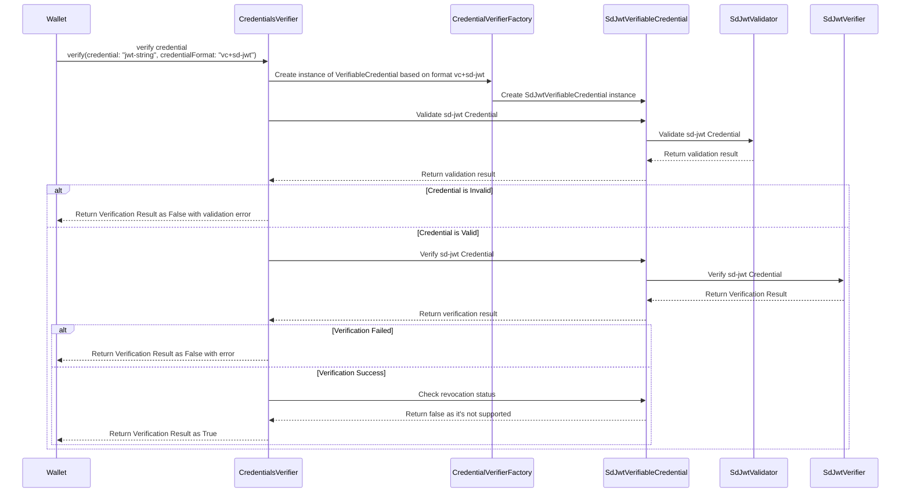
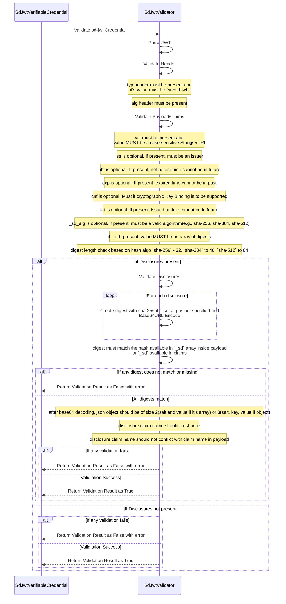
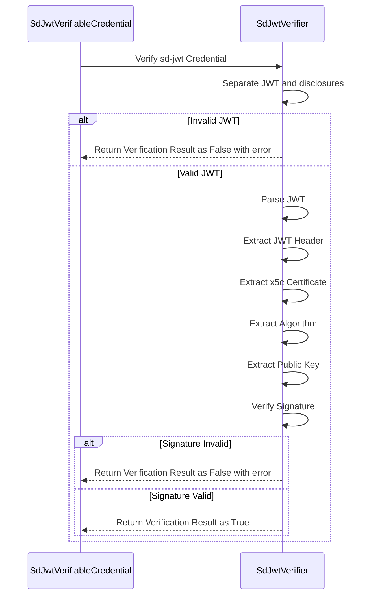

## Support of credential format vc+sd-jwt

This document provides a comprehensive overview of verifying `vc+sd-jwt` Verifiable Credentials (VCs).

### Public key resolution support
X.509 Certificates - Retrieves Issuer's public key using `x5c header parameter` in SD-JWT header.
DID Document - Retrieves Issuer's public key using `kid` in SD-JWT header.

### Steps Involved
1. Add enum value `SD_JWT_VC("vc+sd-jwt")` in `CredentialFormat`
2. Create a new class `SdJwtVerifiableCredential` that implements `VerifiableCredential` interface. This class will be used to validate and verify the `vc+sd-jwt` format credentials.
   - `validate` method will be used to validate the credential format and its claims.
   - `verify` method will be used to verify the credential signature and disclosures.
   - `isRevoked` method will return false as `vc+sd-jwt` does not support revocation.
3. Create a class `SdJwtValidator` to validate the credential format and claims.
   -  method `validate` to validate the credential format, claims
4. Create a class `SdJwtVerifier` to verify the credential format and claims.
   - method `verify` to verify credential Cryptographic Signature
   - It will verify the disclosures using Cryptographic Hash Verification. (SHA-256 if `_sd_alg` is not specified, otherwise use the algorithm specified in `_sd_alg` claim)
5. Implement the `validate` method in `SdJwtVerifiableCredential` class to perform the following checks:
   - Validate the credential format is `vc+sd-jwt`.
   - Validate the credential claims against the issuer metadata.
   - Ensure that the credential contains required claims as per the issuer's configuration.
   - Check if the credential is expired or not.
   - Ensure that the credential is not revoked (though `vc+sd-jwt` does not support revocation, this check can be a placeholder for future use).
6. Implement the `verify` method in `SdJwtVerifiableCredential` class to perform the following checks:
   - Confirm the credential is not tampered (Cryptographic Signature Verification).
   - Disclosure Verification to confirm sd claims are not tampered (Cryptographic Hash Verification).
7. Implement the `CredentialVerifierFactory` to create an instance of `SdJwtVerifiableCredential` when the credential format is `vc+sd-jwt`.

###  Sequence diagram - validate and verify `vc+sd-jwt` credential format VC

###  Sequence diagram - validation process for `vc+sd-jwt` credential format VC

###  Sequence diagram - verification process for `vc+sd-jwt` credential format VC

